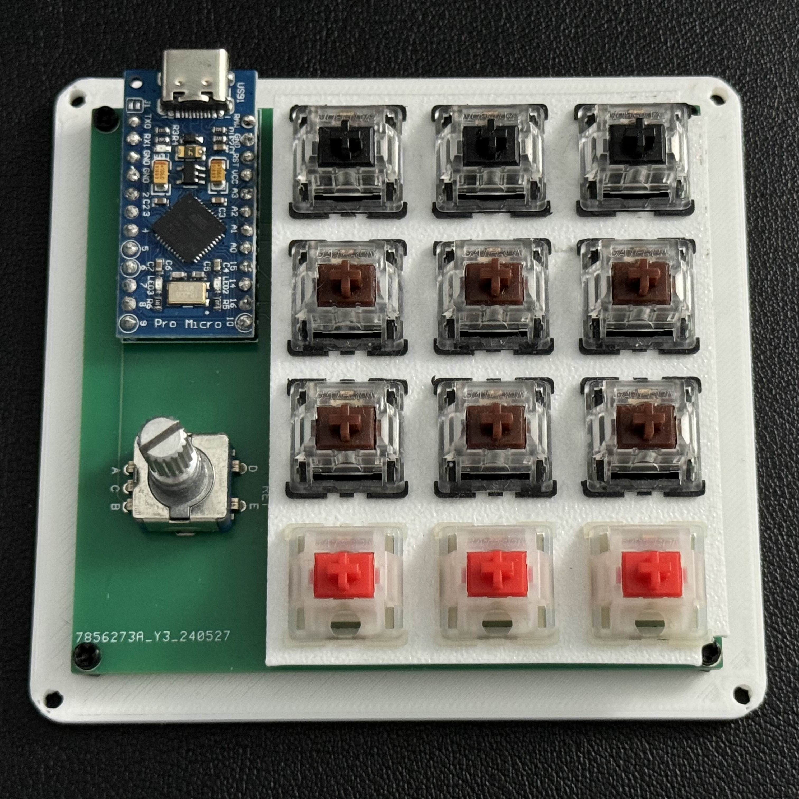

# Keyboards (WIP)

Mechanical Keyboard & Keypad Designs & my process iterating them

## Overview

Since June 2024, I have been designing and prototyping mechanical keypads in order to learn more about PCB Design, 
electronics, firmware, 3D Modeling, and design for manufacturing. Since then, I have gone through 3 main iterations, 
improving on price, footprint/profile, and usability. I hope to end up with a fully polished design that passes as an 
actual product available from a manufacturer. 

### Tools:
- 3D Modeling: [OnShape](https://www.onshape.com/en/)
  - Online
  - Free
  - Well documented
- PCB Design: [EasyEDA](https://easyeda.com/)
  - Free
  - Integraded with JLC PCB
- PCB Provider: [JLCPCB](https://jlcpcb.com/)
  - Extremely Cheap
  - Relatively Fast
  - Supports a wide range of devices for assembly
- Firmware: [QMK](https://qmk.fm/)
  - Open Source
  - Widely used & well documented

 

---

## Rev 3 (Current Version)

### Images

 

#### PCB Schematic

Red traces are top level and blue traces are bottom level.

This is the maximum resolution that EasyEDA will output ._.

### Notes

This latest revision features a reduction in price and footprint and improvements in case and PCB design.

A change to the [RP2040](https://www.lcsc.com/product-detail/Microcontrollers-MCU-MPU-SOC_Raspberry-Pi-RP2040_C2040.html?s_z=h_RP2040) chip cuts prices from ~$5 (ATMEGA32U4) to just $1.02 per microcontroller. Also,
changes to components that JLCPCB can easily source provided additional price drops.

A change to RP2040 microcontrollers, improved design rules, and a sleeker form factor required significant 
board redesigns. While the ATMega32U4 contains in-built flash memory, the RP2040 requires external flash memory, 
leading to an additonal 2MB flash chip. Design rules entailed increased width on data and VCC traces, and smaller
traces for the keyboard matrix. A smaller form factor led to moving all components to the back of the PCB, directly
under the keyboard switches (see PCB Schematic).

Having gotten better at 3D modeling during this time, the case is more asthetic than previous revisions and the fitment on the 
USB port and PCB allows for a sleek look.

---

## Rev 2

### Images

USB Port on Rev2 (Left) vs Rev1 (Right)

- [Microcontroller](https://www.digikey.com/en/products/detail/microchip-technology/ATMEGA32U4-AU/1914602): ATMega32U4-AU

### Notes

The PCB features a change to SMT components, mainly an ATMega32U4 microcontroller, rather than a breakout board such as the 
previous rev's Arduino Pro Micro. 

Because I was using an on-board microcontroller, I made a switch from developing firmware in the Arduino IDE to QMK Firmware,
a robust and open source keyboard firmware.

Due to a lack of forsight and understanding of PCB assembly, I ordered the parts and boards without having them attached. 
As such, I hand-soldered the microcontroller and additional components. Not only was this extremely tedious, I risked 
damaging or incorrectly installing these components. 

Although my PCB design worked for this revision, I used an auto-routing feature and did not adjust trace widths for power 
and data lines.

While the redesigned case with an improved USB port (see above) was sleek, I wanted to improve the footprint and design.

#### Improvements Needed:

Price - ATMEGA32U4 chips are relatively expensive (~$5)
Footprint - A large section of PCB is used solely for components (Left portion)
Design - While the case looks better, I want a sleeker look.
PCB Design - Use best practices for trace widths and decoupling capacitor placement; Order pre-assembled boards.

---

## Rev 1

### Images

- [Microcontroller](https://www.sparkfun.com/products/12640): Ardino Pro Micro (ATMega32U4-MU)

### Notes

This iteration was mainly to get an understanding of the PCB design and order process through JLCPCB. 

The design features 12 keys, a rotary encoder, and an Arduino Pro Micro.

Programming was developed and flashed through the Arduino IDE.

#### Improvements needed:
SMT Microcontroller  
Improve asthetics with black board  
Streamline case design  

---